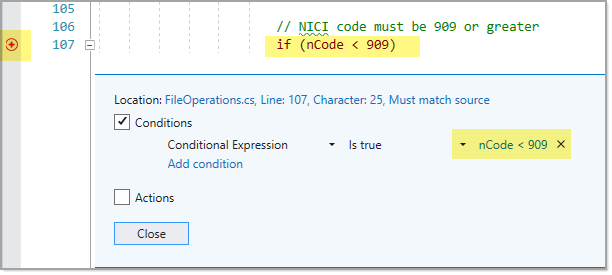

# Debugging

There is a lot code but a tiny questionable section of code which is usually the case.

# About

Code to parse a delimited file that works. Other projects will be broken on purpose to learn debugging operations.

Microsoft TechNet: [Processing CSV files (Part 1)](http://example.com)

[Original source](https://github.com/karenpayneoregon/ImportingCsvFiles)

## Considerations for processing data

The following should always be considered when importing CSV files.
- All columns are suspect to be missing altogether or missing in one or more rows.
- Mixed data types, consider a column with dates where some rows may have malformed dates, dates setup for a different culture, columns that should be numeric were some rows have no value or unexpected format etc.
- Columns which have values that are not valid to your business e.g. a list of products that need to map to a product table where there are products that you don’t handle.
- Column values out of range e.g. a numeric column has a range of 1 through 10 but incoming data has values 1 through 100.
- The file is in use by another process and is locked.
- The file is extremely large and processing time may take hours, have a plan such as to run a nightly job.
- Handling rows/columns that don’t fit into the database, have a plan to handle them as several examples will be shown in this series.
- Offering clients, a method(s) to review suspect data, modify or reject the data.
- Consider an intermediate database table so that processing suspect data can be done over time especially when there is a large data set that may take hours or days to process.

Consider working with CSV files as a puzzle no matter what the structure should be and that parsing different files usually has their own quirks.

## Goal

To read a simple CSV file just over 7,500 records, nine columns with types ranging from integer, float, date time and strings with malformed data.

During parsing assertion is performed to validate data is the proper types, not empty and if in validate ranges. Data read in is placed into a list of a class designed to handle the data read in from the CSV file.

## Parsing data using TextFieldParser

This example uses a [TextFieldParser](https://docs.microsoft.com/en-us/dotnet/api/microsoft.visualbasic.fileio.textfieldparser?view=netframework-4.8) to process data. Rather then splitting lines manually as done above TextFieldParser.ReadFields method handles the splitting by the delimiter assigned in parser.Delimiters. The remainder for validating data is no different then done with StreamReader. One major difference is empty lines are ignored unlike with [SteamReader](https://docs.microsoft.com/en-us/dotnet/api/system.io.streamreader?view=netframework-4.8) .

