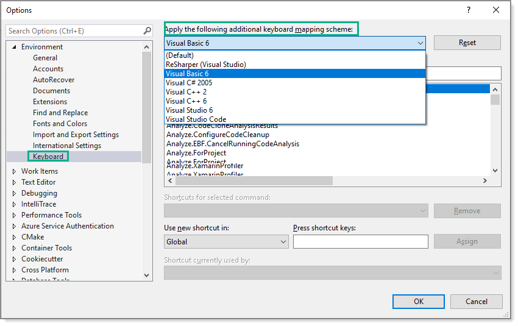
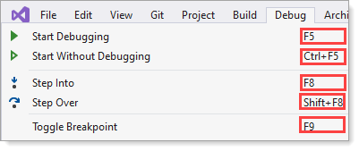
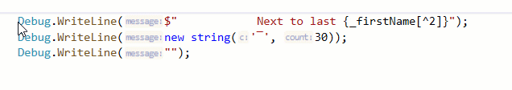
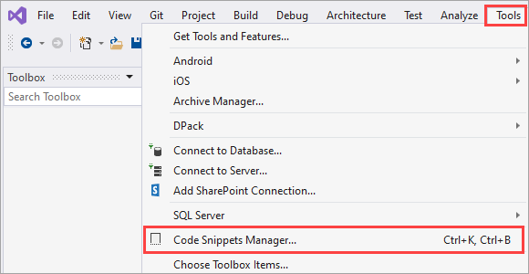
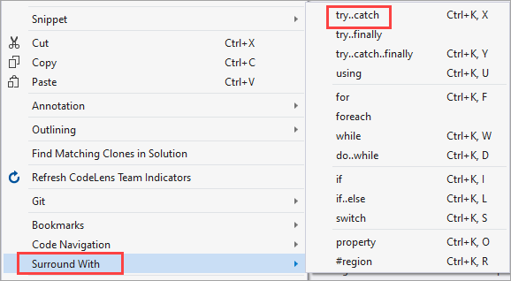
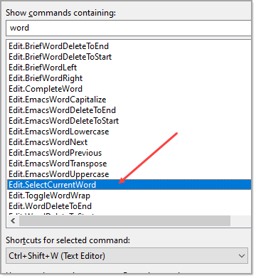

# Keyboard shortcuts

Common shortcuts may or may not be the same for all keyboard mapping schemas. In the table below are several common shortcuts.




To learn about shortuts investiage in Visual Studio menues e.g.



When not using the default mapping keyboard schema keyboard shortcuts be another shorcut may contradict one another. 

For instance to toggle code outlines may be <kbd>CTRL</kbd> + <kbd>O</kbd>, <kbd>M</kbd> but really be <kbd>CTRL</kbd> + <kbd>M</kbd>, <kbd>M</kbd>.

This is not a Visual Studio issue per-say as in the majority of cases it's done by a user even when Visual Studio warns againsts this.


:green_circle: [Keyboard shortcuts in Visual Studio](https://docs.microsoft.com/en-us/visualstudio/ide/default-keyboard-shortcuts-in-visual-studio?view=vs-2019)

| Command  | Keyboard shortcuts |
| :--- | :--- |
| Comment code block | <kbd>CTRL</kbd> + <kbd>K</kbd>, <kbd>C</kbd> |
| Uncomment code block | <kbd>CTRL</kbd> + <kbd>K</kbd>, <kbd>U</kbd> |
| Format code | <kbd>CTRL</kbd> + <kbd>K</kbd>, <kbd>D</kbd> |
| Surround code | <kbd>CTRL</kbd> + <kbd>K</kbd>, <kbd>S</kbd> |
| Editor to solution | <kbd>Ctrl</kbd> + <kbd>R</kbd> |
| View output window | <kbd>Ctrl</kbd> + <kbd>Alt</kbd> + <kbd>O</kbd> |
| Solution to editor | <kbd>Ctrl</kbd> + <kbd>F12</kbd> |
| Duplicate line | <kbd>CTRL</kbd> + <kbd>D</kbd> |
| Debug selected project | <kbd>F5</kbd> |
| Rebuld solution | <kbd>CTRL</kbd> + <kbd>SHIFT</kbd> + <kbd>B</kbd> |
| Buld current project | <kbd>CTRL</kbd>  + <kbd>B</kbd> |
| Clipboard list | <kbd>CTRL</kbd> + <kbd>SHIFT</kbd> + <kbd>V</kbd> |


---


| Select columns of text  |
| :--- |
| To select columns of text <kbd>CTRL</kbd> + <kbd>ALT</kbd> then using arrow keys <kbd>⇦ </kbd> or  <kbd>⇨</kbd> or <kbd>⇧</kbd> or <kbd>⇩</kbd> to select text. See the following video (which shows only [online](https://github.com/karenpayneoregon/oed-week1/blob/Week2/KeyboardShortcuts.md)).| 



# Creating common statements

| Note  |
| :--- |
| Each example may vary as I have Resharper yet the important thing is to press <kbd>TAB</kbd> <kbd>TAB</kbd> after a statement with no spaces e.g. if<kbd>TAB</kbd> <kbd>TAB</kbd>.  I had Bick try this and it works perfectly. |

See the full list of snippets in the Snippets Manager



---

| Note  |
| :--- |
| Statements are case sensitive e.g. **if** is correct, **If** is incorrect. |

To create an `if` statement type

if<kbd>TAB</kbd> <kbd>TAB</kbd>

Result

```csharp
if ()
{
    
}
```

To create a `for` statement

for<kbd>TAB</kbd> <kbd>TAB</kbd>

```csharp
for (int i = 0; i < UPPER; i++)
{
    
}
```

**for recommendation**

Change 'i' to `index`


To create a `foreach` statement

foreach<kbd>TAB</kbd> <kbd>TAB</kbd>

```csharp
foreach (var VARIABLE in COLLECTION)
{
    
}
```

**Surround with**

To wrap code with a statement like a try-catch, select the code below, right click, select surround with.

If a real appliation we would first assert the file exists using [File.Exists](https://docs.microsoft.com/en-us/dotnet/api/system.io.file.exists?view=net-5.0).

```csharp
string fileName = "SomeFile.txt";
var lines = File.ReadAllLines(fileName);
foreach (var line in lines)
{
    if (!string.IsNullOrWhiteSpace(line))
    {
        // do something
    }
}
```




After selecting try-catch

```csharp
try
{
    string fileName = "SomeFile.txt";
    var lines = File.ReadAllLines(fileName);
    foreach (var line in lines)
    {
        if (!string.IsNullOrWhiteSpace(line))
        {
            // do something
        }
    }
}
catch (Exception ex)
{
}
```

Recommenations for try catch.

- Never have an empty catch
- Rename `ex` to `exception`

# See also

[Working the keyboard](https://karenpayneoregon.github.io/visual-studio/keyboard.html) 


# Select current word

A useful shortcut. Karen will talk about this




# Close current editor window

Search for `Window.CloseDocumentWindow` and assign a key combination, be careful that another itemm is not using it.

For example, I would not assign <kbd>control</kbd> + <kbd>shift</kbd> + <kbd>W</kbd> as I use that for selecting a word.


&nbsp;&nbsp;


