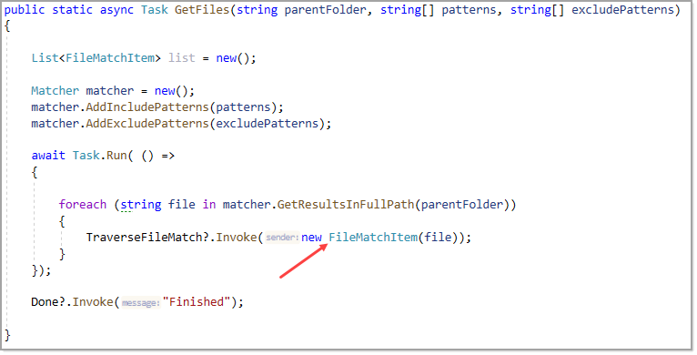
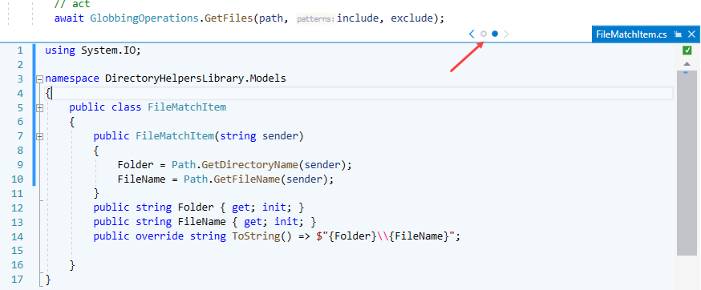

# Edit menu

Take a tour with attendees

# Peeking/traversing

Typically code is broken into separate classes, for instance we have a class named GlobbingOperations with a method, GetFiles.  A developer writes a unit test and another developer inspects the unit test. To view GetFiles the inspector can a) navigate to the method in Solution Explorer or hover over GetFiles, hold down <kbd>CTRL</kbd> and click with the mouse to go to GetFiles or even better, right click on GetFiles and select peek at definition.

```csharp
[TestMethod]
[TestTraits(Trait.Globbing)]
public async Task ExcludeAssemblyDesignerTest()
{
    // arrange
    string path = DirectoryHelper.SolutionFolder();

    string[] include = { "**/*.cs" };
    string[] exclude =
    {
        "**/*Assembly*.cs", 
        "**/*Designer*.cs"
    };

    // act
    await GlobbingOperations.GetFiles(path, include, exclude);

    // assert

    /*
     * Determine if real-time list contains files in static list
     */
    bool hasAll = AssemblyDesignerStaticFileList()
        .All(fileName => AssemblyDesignerResultList.Contains(fileName));

    Assert.IsTrue(hasAll, 
        "Globbing Assembly Designer with Contains.All failed.");

}
```

Next in the above code there is a class and we want to view this and keep the other windows visible. Right click on `FileMatchItem` and select peek at definition.



**Result**

In the secondary window navigation between windows is done with `<` `>` or clicking the circles between `<` `>`.

