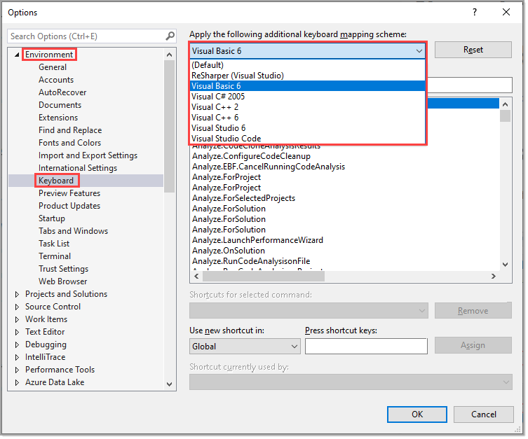
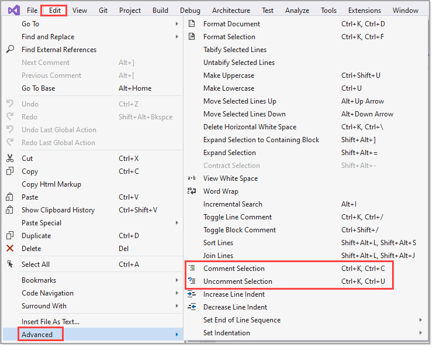
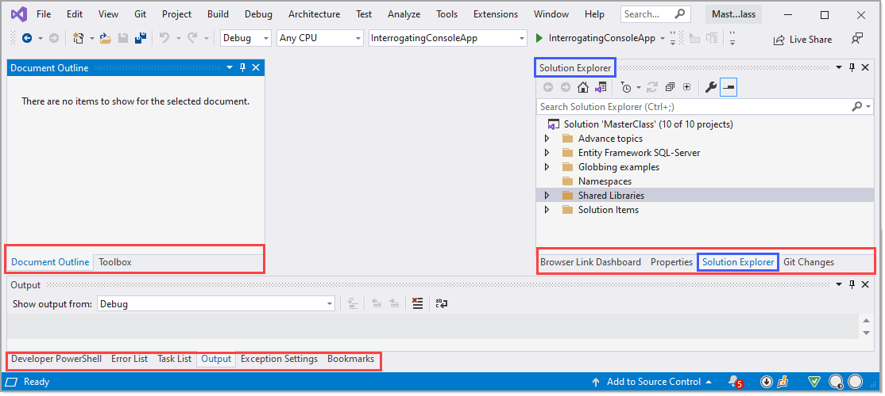
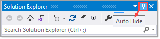
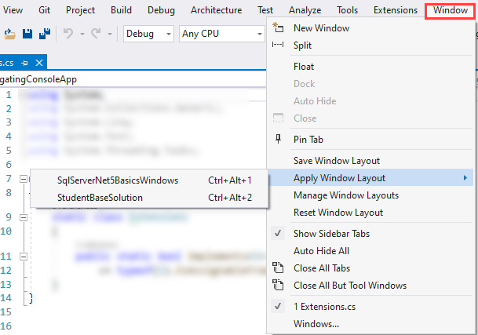
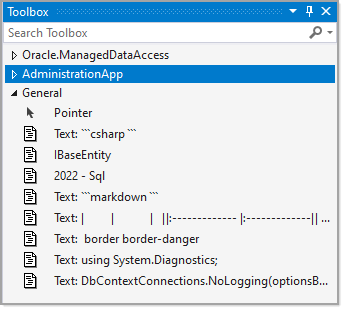

# Navigating the IDE

# Keyboard shortcuts

Visual Studio offers several `mappings` for `keyboard layout`. 

Karen is stuck with `Visual Basic 6` (and has never used VB 6), long story.

Recommend staying with the default as all documentation points to the default scheme.

- [Working the keyboard](https://karenpayneoregon.github.io/visual-studio/keyboard.html) (Karen)
- 

## Shortcuts for common operations

Best way is to navigate the menu system. Some shortcuts like comment/uncomment code is buried as shown below. 

There will be some operations without shortcuts, you can add them but can be difficult in two way, first, another operation is using that shortcut, second it's downright difficult to find some of the operations which are shown in the screenshot above. 

### Important

When looking at Karen's Visual Studio, there will be menu items that you don't have, ask Karen about those.

# Windows

There are many ways for window placement. the following shows Karen's recommendation.

# Arranging windows

Visual Studio allows developers to arrange various windows in different locations. 

For instance, for a developer with one than one monitor, open two files, drag one to another monitor.

There are other windows like Solution Explorer which provides navigations files and many operations or the property window for reading and setting properties for files and objects. These windows can be shown or use auto-hide feature.

Windows like Solution Explorer and properties along with others can be positioned as per the following video.

Here `Test Explorer` is selected, Hold down <kbd>CTRL</kbd> and the mouse until the desired location is selected then release.

## Split same file

A developer may have a file with hundreds of lines and wants to traverse to another location while leaving the current location shown.

## Other options

# Code snippets

[Code snippets](https://docs.microsoft.com/en-us/visualstudio/ide/code-snippets?view=vs-2019) are small blocks of reusable code that can be inserted in a code file using a right-click menu (context menu) command or a combination of hotkeys. They typically contain commonly used code blocks such as `try-finally` or `if-else` blocks, but they can be used to insert entire classes or methods.

## Resharper Postfix templates

Resharper is a third party extension which Karen and Lindon use.

[Postfix templates](https://www.jetbrains.com/help/resharper/Postfix_Templates.html) help you transform expressions that you have already typed without jumping backwards � just type a dot after an expression and pick a template from the completion list.

# Tips

- Edit menu (more than listed below)
  - Paste Special
  - Clipboard history
  - Bookmarks
- 

# Drag-n-drop code

# Visual Studio extensions

Extensions integrate into Visual Studio to provide missing features.

## Recommended extensions (free)

- [Markdown Editor](https://marketplace.visualstudio.com/items?itemName=MadsKristensen.MarkdownEditor) (for VS2019, there is another for VS2022)
- [GitHub Extension for Visual Studio](https://marketplace.visualstudio.com/items?itemName=GitHub.GitHubExtensionforVisualStudio)
- [EF Core Power Tools](https://marketplace.visualstudio.com/items?itemName=ErikEJ.EFCorePowerTools)
- [Browser Reload on Save](https://marketplace.visualstudio.com/items?itemName=MadsKristensen.BrowserReloadonSave)
- [DPack](https://marketplace.visualstudio.com/items?itemName=SergeyM.DPack-16348)
- [Paste SQL to C# Classes](http://www.gui-innovations.com/visual-studio-add-ins/paste-sql-classes.html)

## Recommended extensions (paid for)

- [Resharper](https://www.jetbrains.com/resharper/)

# Third party libraries

- [Telerik and Kendo UI components](https://www.telerik.com/) - I used this library at DOR and have a full license  at OED