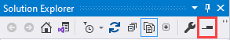
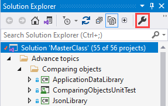
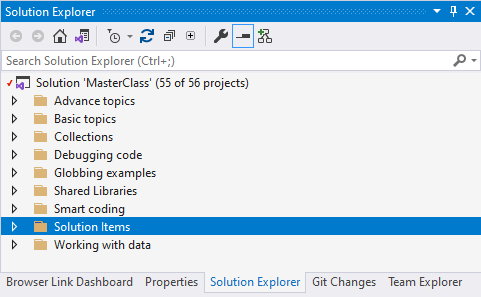
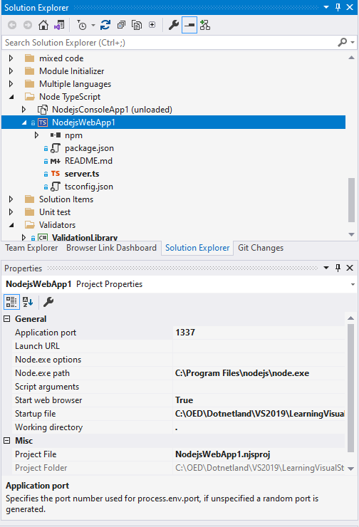
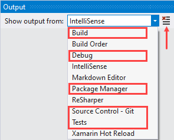
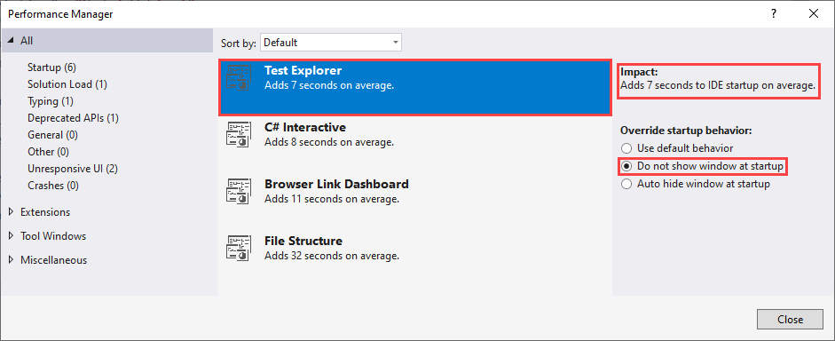
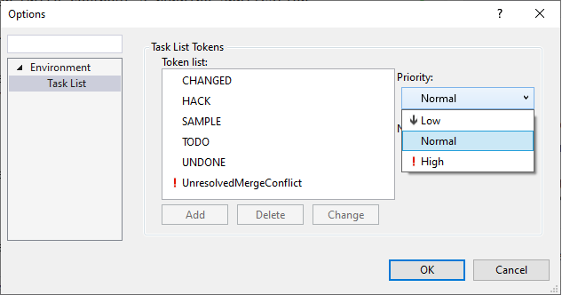
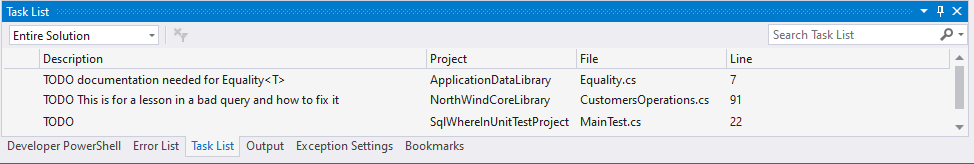

# Navigating the IDE

Visual Studio IDE can be difficult to find what a developer needs for `first timers`.

First thing to do is figuring out what windows are useful to have open which are.

# Solution explorer 

Which when a Visual Studio solution is open provided access to code. Besides opening a solution in solution explorer folders can be opened. 

Suppose there are several solutions under a folder e.g. C:\OED\Dotnetland\VS2019\Claims like mobile and regular claims. Opening C:\OED\Dotnetland\VS2019\Claims in folder view provides access to these solutions.

Solution Explorer provides a feature which when the button below is clicked single clicking on any source code file will open that file on the right in preview mode, repeat this on another file, the current file is closed and the current file is opened. To keep the current file open, double click the file in solution explorer or started editing the current file.

Solution Explorer properties

- Initial page displays options for which project should be the startup project. Current selection means the current selected project rather than how most developers set the startup project, right click a project in solution explorer and set from there. Last option, start multiple projects (like first starting a service which the main project depends on).
- There are several other options which we are not getting into a this level of training except for Configuration properties. By default, each project will be included in the build process, a developer can uncheck a project to exclude in the build process. 

## Suggested position

Docked on the left or right side of the IDE and pinned.

Note other windows are tabbed to full length, some developer like to have multiple windows stacked, that is an option but why reduce the view? I rather go with the first setup than the second but its a developer's choice.

**Stacked**

## See also

[Learn about Solution Explorer](https://docs.microsoft.com/en-us/visualstudio/ide/use-solution-explorer?view=vs-2019)

<kbd>*</kbd> Best guess is Visual Studio 2022 will change some of the above as VS2019 permits 32 or 64 bit builds while VS2022 is 64bit only.

# Output window

Suggest keeping this window open at the bottom of the IDE, full width as in some cases text written to this window can be rather long.

Important output, note the button right side is for clearing the current window.

| Window | Its for   | 
|:------------- |:-------------|
| Build      | shows progress of a build along with suggestions to improve code. When there is a suggestion with a line number, double click to traverse to that line.|
| Debug | Displays information from output like Debug.WriteLine |
| Package Manager | Displays output for when installing a NuGet package |
| Source Control | Displays message from various git operations e.g. commit, pull, fetch|
| Tests | Output from running unit test. This information can be useful when there are issues running unit test|

# Test Explorer

For running unit test.

When properly writing code without ReSharper keep this window open. This is a caught, when there are many test in a solution like over 100 best to have Visual Studio not open test explorer when Visual Studio is first loaded as it increases time for visual studio to initialize.

If using Visual Studio several times with Test Explorer open try the following.

- Select the `Help` menu
- Select `Visual Studio performance manager`

If there are suggestions, decide if the wait time is acceptable or not.

**What are**

**C# Interactive** 

in short a developer can write code and run without a running application.

Out of the box this works great for .NET Framework but not .NET Core Framework. To get this to work for .NET Core Framework

- Execute `#reset core`
- Then select CPU via `#reset 32` or `#reset 64`

**File Structure**

This is a window for ReSharper (if interested check out [the docs](https://www.jetbrains.com/help/resharper/Reference__Windows__File_Structure_Window.html)). I use this all the time.

# Bookmarks

Very useful when traversing a large project to remember various pieces of code. Creating a bookmark names it BookmarkN where N is incremented for each bookmark. Since these are fairly meaningless, right click on a bookmark and give it a meaningful name.

# Browser Link Dashboard

Useful for writing Razor pages, otherwise not needed. In short if an edit is not being updated one reason if the current project is not being watched for several different reasons.

# Task List

Very useful but is personal, not part of a Visual Studio solution.

Example usage, place TODO in a comment and it shows up with text to the right as shown below

# Keyboard shortcuts

Visual Studio offers several `mappings` for `keyboard layout`. 

Karen is stuck with `Visual Basic 6` (and has never used VB 6), long story.

Recommend staying with the default as all documentation points to the default scheme.

- [Working the keyboard](https://karenpayneoregon.github.io/visual-studio/keyboard.html) (Karen)
- 

## Shortcuts for common operations

Best way is to navigate the menu system. Some shortcuts like comment/uncomment code is buried as shown below. 

There will be some operations without shortcuts, you can add them but can be difficult in two way, first, another operation is using that shortcut, second it's downright difficult to find some of the operations which are shown in the screenshot above. 

### Important

When looking at Karen's Visual Studio, there will be menu items that you don't have, ask Karen about those.

# Windows

There are many ways for window placement. the following shows Karen's recommendation.

# Arranging windows

Visual Studio allows developers to arrange various windows in different locations. 

For instance, for a developer with one than one monitor, open two files, drag one to another monitor.

There are other windows like Solution Explorer which provides navigations files and many operations or the property window for reading and setting properties for files and objects. These windows can be shown or use auto-hide feature.

Windows like Solution Explorer and properties along with others can be positioned as per the following video.

Here `Test Explorer` is selected, Hold down <kbd>CTRL</kbd> and the mouse until the desired location is selected then release.

## Split same file

A developer may have a file with hundreds of lines and wants to traverse to another location while leaving the current location shown.

## Other options

# Code snippets

[Code snippets](https://docs.microsoft.com/en-us/visualstudio/ide/code-snippets?view=vs-2019) are small blocks of reusable code that can be inserted in a code file using a right-click menu (context menu) command or a combination of hotkeys. They typically contain commonly used code blocks such as `try-finally` or `if-else` blocks, but they can be used to insert entire classes or methods.

## Resharper Postfix templates

Resharper is a third party extension which Karen and Lindon use.

[Postfix templates](https://www.jetbrains.com/help/resharper/Postfix_Templates.html) help you transform expressions that you have already typed without jumping backwards � just type a dot after an expression and pick a template from the completion list.

# Tips

- Edit menu (more than listed below)
  - Paste Special
  - Clipboard history
  - Bookmarks
- 

# Drag-n-drop code

# Visual Studio extensions

Extensions integrate into Visual Studio to provide missing features.

## Recommended extensions (free)

- [Markdown Editor](https://marketplace.visualstudio.com/items?itemName=MadsKristensen.MarkdownEditor) (for VS2019, there is another for VS2022)
- [GitHub Extension for Visual Studio](https://marketplace.visualstudio.com/items?itemName=GitHub.GitHubExtensionforVisualStudio)
- [EF Core Power Tools](https://marketplace.visualstudio.com/items?itemName=ErikEJ.EFCorePowerTools)
- [Browser Reload on Save](https://marketplace.visualstudio.com/items?itemName=MadsKristensen.BrowserReloadonSave)
- [DPack](https://marketplace.visualstudio.com/items?itemName=SergeyM.DPack-16348)
- [Paste SQL to C# Classes](http://www.gui-innovations.com/visual-studio-add-ins/paste-sql-classes.html)

## Recommended extensions (paid for)

- [Resharper](https://www.jetbrains.com/resharper/)

# Third party libraries

- [Telerik and Kendo UI components](https://www.telerik.com/) - I used this library at DOR and have a full license  at OED

&nbsp;&nbsp;