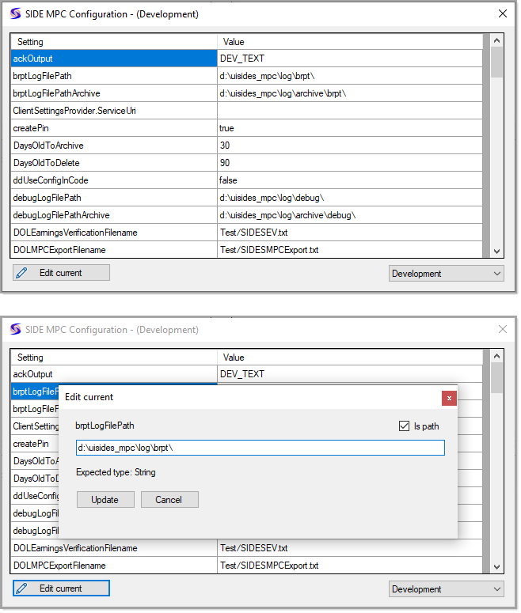

# About

> Base code in this project has eluded countless developers for decades. I spent an hour figuring out how to glue the pieces together as in general this functionality is seldom needed and if done incorrectly can cause issues in the application which uses the altered configuration file. 

Although our primary application types are web there are times when a desktop application can be useful for assisting in this case with configuration of a Windows service for SIDES MPC.

Yes we can create the same functionality in this case or other cases by creating a web utility application which for most will take more time. But there is another option for anytime something is needed quickly, create the desktop solution with the intent to convert to a web utility application. 


In this application all code which could be separated from the user interface has been placed into two classes leaving what could not be placed into classes in the two forms.

Another fallacy in regards to the average developer is to deal with run time exceptions. The code below in the SetValue method uses what is known as tuples in the method and deconstructed for the caller. In the case of SetValue there is a try/catch, when there is an exception it’s passed back to the caller while in the case of no errors null is returned which the caller can then check and decide how to deal with the error if any.


```csharp
private void UpdateButton_Click(object sender, EventArgs e)
{

    var (success, exception) = SettingsOperations.SetValue(_environment, _settingItem.Name, ValueTextBox.Text);

    if (success)
    {
        _settingItem.Value = ValueTextBox.Text;
        DialogResult = DialogResult.OK;
    }
    else
    {
        MessageBox.Show($@"Failed to update{Environment.NewLine}{exception.Message}");
    }

}
```

# Code

- We have .NET Framework Classic and .NET Core. The average developer will gravitate to the newer version of the framework which may or may not be wise. Here I used the older version of the .NET Framework as from experience there is nothing to gain from using the newer framework. If asked I can convert to the newer framework in 30 minutes or less. 
- Coding done has basic level and advance levels.

# Screens



# We can do better

By splitting code out to a class project, `SidesMpcLibrary` code can be shared andd tested.