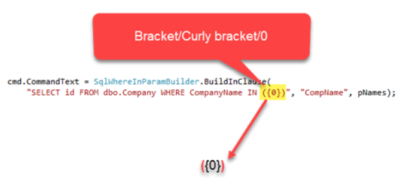

# About

Library for parameterizing SQL statements.

See [GitHub repository](https://github.com/karenpayneoregon/dyynamic-sql-where-in) for details.

# From above repository

Note parenesis then curly brace followed by 0 then close curly brace then close parenesis.

