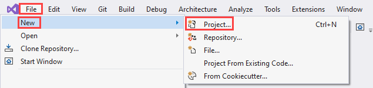
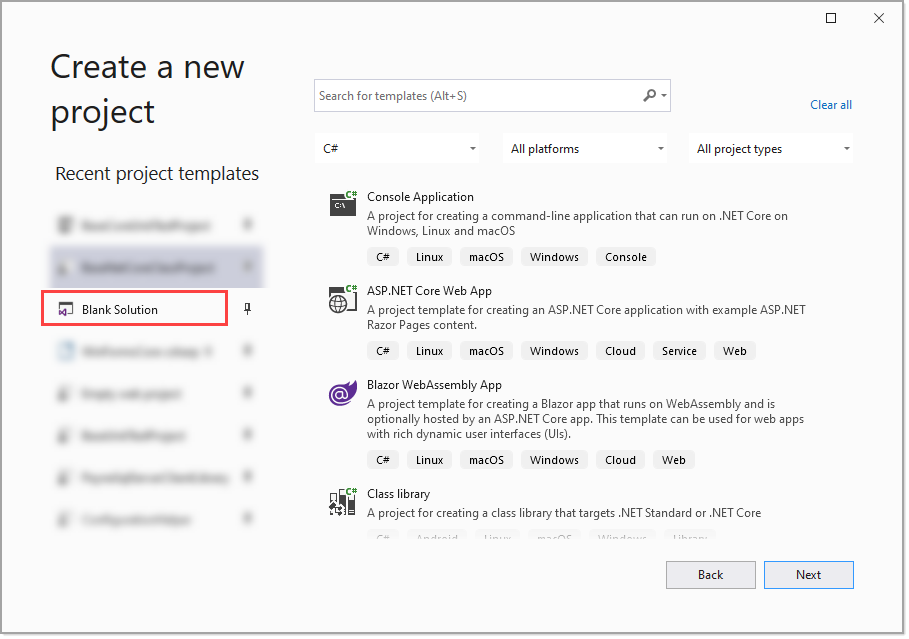
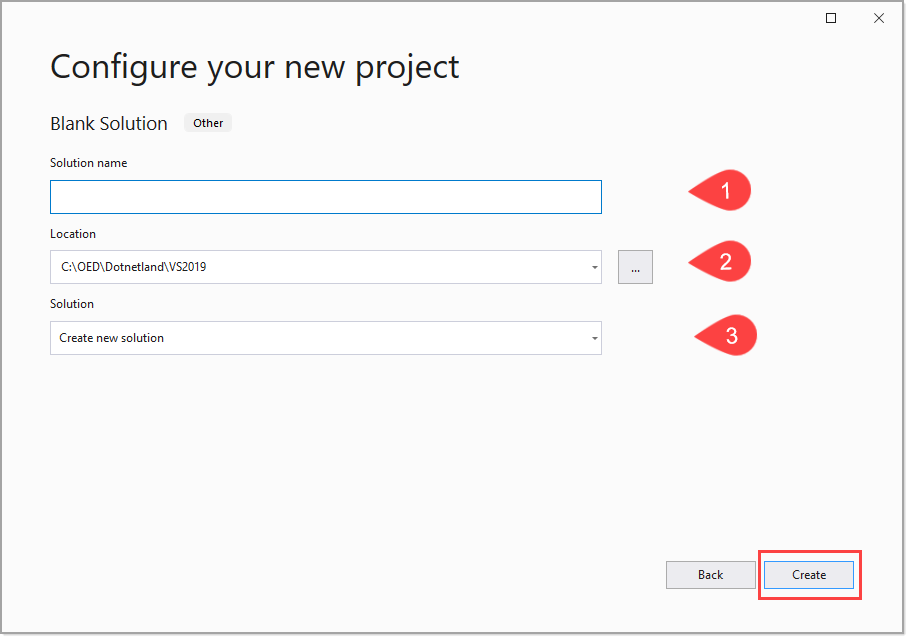

# Basics for creating applications

The starting point to creating an application with Visual Studio is by creating a new Visual Studio Solution.

## Step 1

## Step 2

Select `Blank solution`

1. Enter a name for the solution which starts with upper case character, no spaces. For example, for Claims, `ClaimsSolution`
2. For location, make sure it's under C:\OED\DotNetLand\VS2019 (as we are not using a later version as of March 2022)
3. Leave as is
4. Click the `Create` button

## Step 3

- Before moving forward
  - Will there be local NuGet packages needed
  - Consider what projects are needed. For instance, a `unit test project`, a `class projects` for `data operations` and support code such as for `business logic`, a `frontend project` such as an ASP.NET Core web project.
  - Solution folder names for separating out functionality
  - Create in the root folder of the solution a readme.md file and follow an approved template (yeah we don't have one yet)

### Step 3 A

- Main project namespace: usually will start with company name followed by intent, for example, Oed.SidesConnector but since our applications are kown as OED we can simple use SidesConnector.
- Support projects should conveym purpose/intent, for example for DataAccess, Common.DataAccess but could also be simply DataAccess. If there are third party data access libraries e.g. SomeCompany with a namespace of SomeCompany.DataAccess then use Common.DataAccess. We will get into namespaces in code and aliasing later on.
