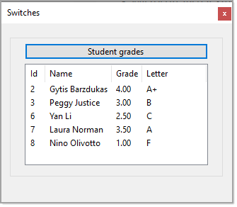

# About

An exploration into a conventional `switch statement` and `switch expression bodied members` in C# 8 and C# 9 with Entity Framework Core 5 along with writing efficient queries.

## Connection string

Comes from ConfigurationLibrary.

```json
{
  "ConnectionsConfiguration": {
    "ActiveEnvironment": "Development",
    "Development": "Server=.\\SQLEXPRESS;Initial Catalog=School;Integrated Security=True",
    "Stage": "Stage connection string goes here",
    "Production": "Prod connection string goes here"
  }
}
```

# Requires 

- Microsoft Visual Studio 2019
- .NET 5 Framework
- C# 9 (*mixure of former versions are used also*) to run


#### Notes

These ~~two~~ one methods are used to get desired results although the second method should be avoided.

- :green_heart: SchoolOperations.GradesForPeople (correct)
- :yellow_heart: ~~SchoolOperations.StudentsForCourse (incorrect but works)~~
- Check out SchoolContext options for logging SQL.

