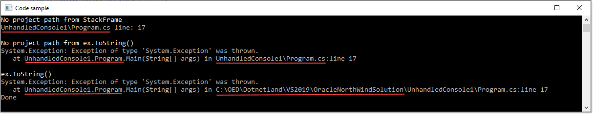

# What's this?

Base code to strip path to project for unhandled exceptions.

- Only tested `as is`, deserves more testing and integrate into a unhandled exception handler.
- Double click the project file which has various options beyond what is in a normal project file.
- First two WriteLine have removed path to offending file
- Last is untouched

