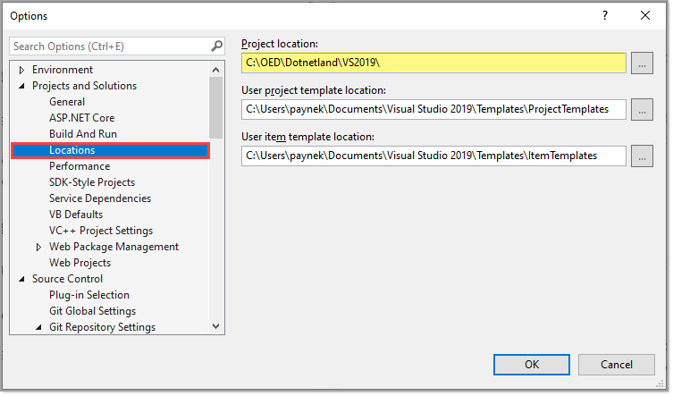
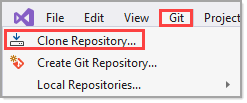

# Folders

## Base folder

All projects need/ to reside under `C:\OED`, outside of this folder OED security denies access to run your projects.

## Commonality 

When developers place their projects in a common location there is a) no guessing where projects reside b) prevents issues with GitHub in that in rare cases there may be files in a Visual Studio solution which use an absolute path.

> In simple words, an absolute path refers to the same location in a file system relative to the root directory, whereas a relative path points to a specific location in a file system relative to the current directory you are working on.

## Versioning 

Each version of Visual Studio offers new IDE functionality and language features. For instance, VS2015 does not understand .NET Core 5 framework as .NET Core Framework was released in VS2019. VS2019 does not understand .NET Core 6 as .NET Core 6 was released with VS2022.

It's best to create projects in the currently installed version of Visual Studio e.g. we are currently using VS2019 so the first path below is used.

- C:\\**OED**\Dotnetland\VS2019
- C:\\**OED**\Dotnetland\VS2022

## Moving to a newer version of Visual Studio

Common practice is to simply open a VS2019 Visual Studio solution in VS2022. Unknown to the developer Visual Studio changes settings which if needed makes it impossible to revert back to VS2019 or VS2019 code requires changes that unless experienced with this (like Karen) the developer is stuck.

Karen's advice is to copy the VS2019 Visual Studio solution to under the second folder above.

**Alternate 1** is to create a new repository branch in the solutions GitHub repository. This works well yet if a developer wants to compare the older version done in VS2019 the developer needs to have two paths (back to Karen's recommendation) with two copies of Visual Studio open, one VS2019, the other with VS2022.

**Alternate 2** is to open the older branch in the GitHub repository with `Visual Studio Code` web edition which is cumbersome and `Visual Studio Code` lacks in functionality compared to `Visual Studio`.

## Visual Studio path options

To ensure projects are placed in the correct location, under `Tools` menu, `Options` set default paths for the current version of Visual Studio.

## Cloning GitHub repository

Make sure to check where the cloned repository will be placed. It's possible that the default path may be under your user profile and if so, make sure to change to the recommend paths above.

&nbsp;&nbsp;