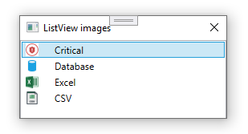
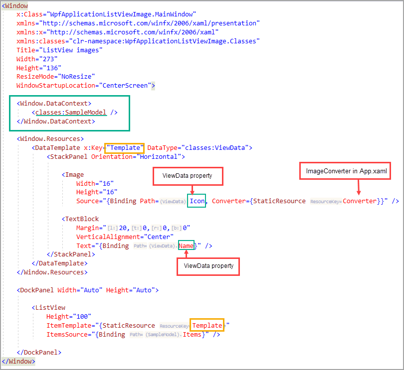

# About

Simple example of working with WPF (Windows Presentation Foundation) to show icons. Icons are shown at design time via [hot-reload](https://docs.microsoft.com/en-us/visualstudio/xaml-tools/xaml-hot-reload?view=vs-2022) and proper data binding.



## Base image container/class

```csharp
public class ViewData
{
    public ViewData(Bitmap icon, string name)
    {
        _icon = icon;
        _name = name;
    }

    private readonly Bitmap _icon;
    /// <summary>
    /// Icon to display
    /// </summary>
    public Bitmap Icon => _icon;

    private readonly string _name;
    /// <summary>
    /// Icon name
    /// </summary>
    public string Name => _name;
}
```

# View model


Returns each Icon immediately via [yield](https://docs.microsoft.com/en-us/dotnet/csharp/language-reference/keywords/yield)


```csharp
public class SampleModel
{
    public IEnumerable<ViewData> Items
    {
        get
        {
            yield return new ViewData(Properties.Resources.critical, "Critical");
            yield return new ViewData(Properties.Resources.Database, "Database");
            yield return new ViewData(Properties.Resources.Excel, "Excel");
            yield return new ViewData(Properties.Resources.csv, "CSV");
        }
    }
}
```

# XAML

## What is XAML

XAML is a declarative markup language. As applied to the .NET Core programming model, XAML simplifies creating a UI for a .NET Core app. You can create visible UI elements in the declarative XAML markup, and then separate the UI definition from the run-time logic by using code-behind files that are joined to the markup through partial class definitions. XAML directly represents the instantiation of objects in a specific set of backing types defined in assemblies. 


For the novice this can be intimidating




# WPF

OED has one WPF application created by a Microsoft contractor. Karen's opinion is this should had been a Windows Form application which would be just as and easier to maintain.

# Advantages

- Limitless possibilities and flexibility to create your own custom UI controls.
- Scalability helps in multi resolution environment.

 # Disadvantages

- Complicated framework compared to WinForms, so developers will need to put more efforts in learning WPF.
- Development process is more time consuming than Windows Forms
- Eclipsed [.NET MAUI](https://docs.microsoft.com/en-us/dotnet/maui/) which lets you build native apps using a .NET cross-platform UI toolkit that targets the mobile and desktop form factors on Android, iOS, macOS, Windows, and Tizen.
  - MAUI is a) requires VS2022 or higher b) immature at this time for a real enterprise app.

# Important

WPF allows a developer to code as one would with Windows Forms, add controls onto a form, give them names and data bind to controls.

With WPF you can do the same as with Windows Forms but when done right about the only control with a name might be a close button but we can get away with no name here to via a CommandBinding as shown [here](https://github.com/karenpayneoregon/wpf-login-annotations-cs/blob/master/ValidateLogin/MainWindow.xaml.cs#L34:L38).